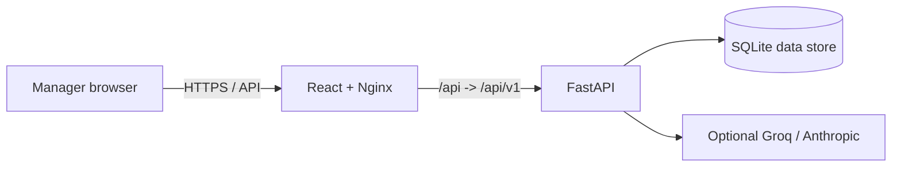

# BBQ Analytics

A secure, manager-facing business-intelligence dashboard for BBQ restaurant operations. It combines sales analytics, product performance, anomaly detection, demand forecasting, and an optional AI assistant.

## What a manager can do

- See revenue, orders, margin, branch performance, and product trends.
- Investigate revenue anomalies and forecasts.
- Ask grounded questions about the restaurant dataset when an AI provider is enabled.
- Use a responsive dashboard with clear loading, error, and empty states.

## Architecture



The browser talks only to the frontend origin. Nginx proxies API traffic to FastAPI, so deployments do not expose a localhost URL or duplicate API configuration in components.

## Quick start

Requirements: Python 3.11+, Node 20+, and the supplied `data/bbq.db` file.

```powershell
Copy-Item .env.example .env
cd backend
python -m venv .venv
.\.venv\Scripts\Activate.ps1
pip install -r requirements-dev.txt
python scripts/create_user.py --username admin --email admin@example.com
uvicorn app.main:app --reload --port 8000
```

In a second terminal:

```powershell
cd frontend
npm ci
npm run dev
```

Open `http://localhost:3000`. The account creation command securely prompts for a password; no credentials are stored in source code.

## Docker deployment

Set a unique 32+ character `JWT_SECRET_KEY` and your public `CORS_ORIGINS` in `.env`, then run:

```powershell
docker compose up --build -d
```

The dashboard is served at `http://localhost:3000`. Create the initial account before exposing the service (using the backend command above, or an equivalent controlled maintenance container). Do not enable `DEMO_MODE` in production.

## Configuration

| Variable | Purpose |
| --- | --- |
| `JWT_SECRET_KEY` | Required production secret for signed access tokens. |
| `CORS_ORIGINS` | Comma-separated browser origins allowed to call the API. |
| `BBQ_DB_PATH` | Path to the SQLite dataset; Docker uses `/data/bbq.db`. |
| `LLM_PROVIDER` | `off`, `groq`, `anthropic`, or `auto`. |
| `GROQ_API_KEY` / `ANTHROPIC_API_KEY` | Optional credentials for AI chat. |
| `DEMO_MODE` | Development-only switch, default `false`. |

## Quality checks

```powershell
cd frontend; npx eslint src --ext .js,.jsx; npm run build
cd ../backend; pytest -q
```

GitHub Actions runs the same checks on pushes and pull requests. See [architecture](docs/ARCHITECTURE.md) and [operations](docs/OPERATIONS.md) for deployment and support guidance.
